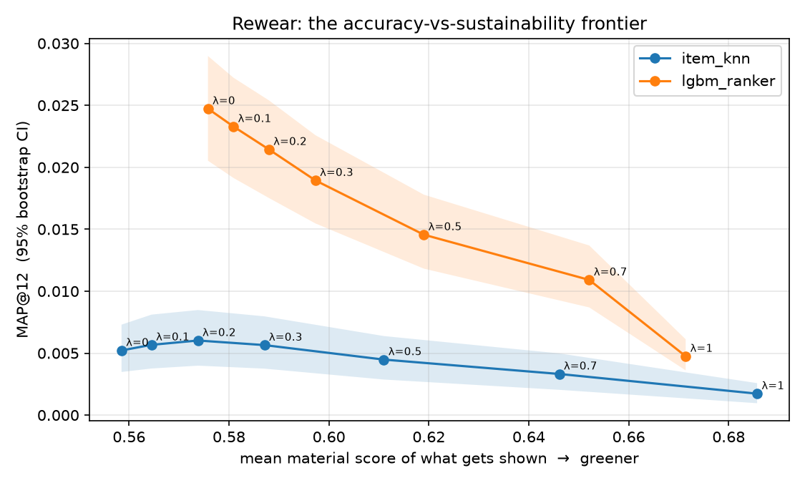

# Rewear

**A fashion recommender that optimizes for what you'll keep wearing, not just what you'll buy.**

Most recommendation systems in fashion have one objective: the next purchase. Rewear asks a different question — *which pieces will earn a place in your rotation?* — and makes the trade-off between engagement and sustainability explicit, measurable, and tunable, instead of pretending the engagement-optimal ranking is the only one that exists.

Built on the [H&M Personalized Fashion Recommendations](https://www.kaggle.com/competitions/h-and-m-personalized-fashion-recommendations) dataset: ~1.3M customers, ~105k articles with images and descriptions, ~31M real transactions.

**[▶ Try the live demo](https://namoos99.github.io/Rewear/demo/)** — pick a wardrobe, drag the dial, watch twelve recommendations reorder and see what it costs in accuracy.

> "The goal is to turn data into information, and information into insight." — Carly Fiorina

## What makes it different

Standard pipeline: candidates → rank by predicted purchase probability → show top 12.

Rewear pipeline: candidates → rank by relevance → **rerank by a sustainability score with a single dial (λ)** → show top 12, and *report what that dial cost you in accuracy.*

The sustainability score blends three signals per item:

| Signal | What it measures | How it's derived |
|---|---|---|
| `material_score` | Fibre impact | Parsed from product descriptions (organic cotton, linen, recycled ↑ — virgin polyester, acrylic ↓) |
| `wear_again_score` | "Becomes a staple" | Category-level repurchase rate: how often buyers in this category come back for more of it |
| `popularity` (penalised) | Fast-fashion churn | Purchase count — chasing the head of the curve is what the industry already does well without help |

Every model is evaluated on **accuracy and beyond**: MAP@12 (the Kaggle metric), catalogue coverage, novelty, and long-tail exposure. The interesting output isn't a single score — it's the curve showing how much MAP@12 you give up for each unit of sustainability, so a product team can choose a point on it deliberately.

## Results

*Phase 1 on 50,000 sampled H&M customers (real data). Validation = final week held out; 2,590 customers with purchases in that week; catalogue of 71,940 articles.*

| model | MAP@12 | coverage | novelty | long-tail exposure |
|---|---|---|---|---|
| popularity | 0.00810 | 0.0002 | 4.98 | 0.17 |
| item-kNN | 0.00522 | 0.2501 | 8.02 | 0.74 |
| item-kNN + Rewear (λ=0.2) | **0.00602** | 0.2473 | 7.98 | 0.73 |
| item-kNN + Rewear (λ=0.5) | 0.00448 | 0.2199 | 7.94 | 0.72 |

Two findings. First, popularity wins on raw accuracy — the same result the Kaggle leaderboard produced, now confirmed here, and the reason Phase 3 exists. Second, and more interesting: a *light* sustainability rerank (λ=0.2) doesn't just cost accuracy, it **improves** MAP@12 by 15% over plain item-kNN while giving up almost nothing in coverage or novelty. The wear-again and material signals appear to regularise a noisy collaborative-filtering signal. Above λ≈0.3 the expected trade-off takes over and accuracy falls. That knee in the curve is the product decision — and Phase 4 puts confidence intervals on it.

### Phase 3 — the learned ranker

The Phase 1 result is a *recall* problem: no single retriever sees the whole picture. Phase 3 unions candidates from four sources (repurchase, item-kNN, content similarity, popularity) and trains a LightGBM LambdaRank model to order them. The ranker is trained on a held-out "label week" it never sees at evaluation time, so there's no leakage. The sustainability signals go in as *features* — the model decides what they're worth for purchase probability.

*50,000 sampled H&M customers (real data), same validation week as Phase 1.*

| model | MAP@12 | coverage | novelty | long-tail exposure |
|---|---|---|---|---|
| popularity | 0.00810 | 0.0002 | 4.98 | 0.17 |
| item-kNN | 0.00522 | 0.2501 | 8.02 | 0.74 |
| **LightGBM ranker** | **0.02473** | 0.0605 | 4.55 | 0.16 |

The ranker beats popularity by roughly 3x, with a 95% bootstrap interval (0.0205–0.0290) that doesn't overlap popularity's territory — this is where Phase 1's loss gets reversed. The top features by gain are recency (days since an article last sold, days since the customer last bought) and repurchase rank, not the sustainability signals — the model is mostly rediscovering "what's fresh and what this customer already likes," which is the expected, sensible thing for a purchase-probability model to learn.

### Phase 4 — the frontier, with uncertainty

A single MAP@12 on 2,590 customers is noisy, so every point on the λ sweep gets a 95% bootstrap interval (resampling customers). For the ranker, λ=0 is already the best MAP@12 — unlike the light-λ effect seen with item-kNN in Phase 1, the ranker doesn't need sustainability signals to regularise it, so accuracy declines steadily as λ increases. That's the expected, honest trade-off curve, and the plot below traces exactly how much each step costs.



Full table with intervals: `results/frontier.csv` after `make ranker`.

### External validation

Kaggle's official leaderboard for this dataset gives a second, independent read on these numbers. A pure-popularity submission — no personalization at all — scores about 0.0056. A silver-medal solution (45th of 3,006 teams, ensembling two candidate-generation strategies across three separate ranking models) scores roughly 0.0292–0.0300. Our Phase 3 ranker's internal validation score, 0.0247, falls in that same range — encouraging, though not a direct comparison, since it's measured on our own held-out week rather than Kaggle's official test set.

## Quickstart

```bash
git clone https://github.com/Namoos99/Rewear && cd Rewear
python -m venv .venv && source .venv/bin/activate
pip install -e ".[dev]"

make sample      # synthetic data with the exact H&M schema — no download needed
make test        # 19 tests, ~5 seconds
make evaluate    # Phase 1 table + λ sweep → results/phase1_results.csv
make ranker      # Phases 3–4: LightGBM ranker, bootstrap frontier → results/, docs/frontier.png
make demo        # Phase 5: static demo → docs/demo/index.html
```

To run on the real data: download the Kaggle archive into `data/raw/` (you need `articles.csv`, `customers.csv`, `transactions_train.csv`; images are optional until Phase 2), then:

```bash
python scripts/evaluate.py --data data/raw --sample-customers 50000
python scripts/train_ranker.py --data data/raw --sample-customers 50000
```

## Project layout